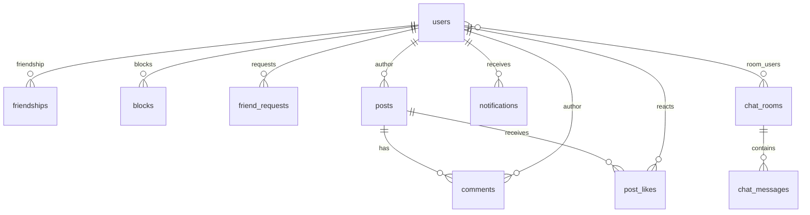

# ft_transcendence

> This project has been created as part of the 42 curriculum by **smeixoei, igvisera, davidga2, abarrio-, ancarvaj**.

A full-stack social web platform — the final 42 School project — combining social
networking, real-time communication and real-time multiplayer games in a single
web application, deployed with Docker and instrumented with a complete
observability stack.

---

## Table of Contents

- [Description](#description)
- [Team Information](#team-information)
- [Project Management](#project-management)
- [Technical Stack](#technical-stack)
- [Database Schema](#database-schema)
- [Features List](#features-list)
- [Modules](#modules)
- [Individual Contributions](#individual-contributions)
- [Instructions](#instructions)
- [Ports and Services](#ports-and-services)
- [Makefile Commands and Repository Rules](#makefile-commands-and-repository-rules)
- [Resources](#resources)
- [Known Limitations](#known-limitations)
- [License](#license)

---

## Description

**ft_transcendence** is the capstone project of the 42 common core. The goal is to
build, from scratch, a complete and deployable web platform: users can register,
log in (locally or through their 42 account), build a rich profile, interact with
each other through friends, posts and a real-time chat, and play real-time
multiplayer games against each other — all behind a secure reverse proxy and with
full monitoring and logging.

The project was designed as a modern "social network" clone: a single-page
application (SPA) served through Nginx, a REST API plus WebSocket layer written in
Go, a PostgreSQL database, Redis for ephemeral state, and a DevOps toolchain
(Prometheus, Grafana, ELK Stack) that makes the platform observable.

### Key features

| Area | Features |
|------|----------|
| **Authentication** | Local register/login, OAuth 2.0 login with 42 Intra, JWT sessions, TOTP two-factor authentication, account deletion |
| **Profiles** | Custom avatar & banner, personal state/description, birthday, visit counters, profile views depending on relationship |
| **Social graph** | Friend requests (send/accept/reject), block & unblock, delete friendship |
| **Content** | Posts with text, images and PDF upload, comments, likes & dislikes, delete confirmations |
| **Real-time chat** | Persistent WebSocket chat, message history, block-aware message sending, optimistic inserts, unread activity |
| **Notifications** | Real-time push (WS) + HTTP polling for friend requests, likes, comments and accepted requests |
| **Search** | Advanced search with filters, ordering and pagination over the user base |
| **Games** | Real-time multiplayer **Tic Tac Toe**, **Connect Four** and **Game of the Goose** (up to 6 players), local & online modes, spectators, disconnect/reconnect handling |
| **DevOps** | Docker Compose orchestration, Nginx reverse proxy with TLS, Prometheus + Grafana, ELK Stack, CI via GitHub Actions |
| **Testing** | pytest integration suite, Go unit tests, automated CI pipeline |

---

## Team Information

| Member | Login | Assigned roles | Responsibilities |
|--------|-------|----------------|------------------|
| Sara Meixoeiro | `smeixoei` | Product Owner/Technical Lead - Backend & Frontend & DevOps Developer | Frontend designer; Designed and implemented the real-time game engine (backend) and the games UI (frontend); initial frontend setup (router, styles, aliases); health check endpoint; DevOps; OAuth 42; DB-Gorm integration; Healthcheck; 2FA; CORS |
| Ángela Barrio | `abarrio-` | Project Manager/Technical Lead - Frontend & Backend Developer | Backend Designer; Routing & server conf; Advanced search (backend + frontend); profile layout and relationship-based views; block/unblock/delete-friend interactions; 404 page; early project scaffolding, epics documentation and error-handling middleware. |
| Ignacio Viseras | `igvisera` | Frontend Developer | Redis integration and environment configuration; base UI components; profile view; Responsive; UX UI desing |
| David García Varas | `davidga2` | Technical Lead - Frontend & Backend Developer | Posts, comments and reactions (likes/dislikes); image and PDF upload; avatar and banner management; reusable UI components; visual identity and SCSS/BEM design system; footer informational pages. Login & register pages; DB-Gorm integration |
| ancarvaj | `ancarvaj` | Frontend & Backend & DevOps Developer | WebSocket architecture (hub, rooms, clients); persistent chat; notifications system; Nginx WebSocket proxying; Docker Compose infrastructure; GitHub Actions CI; integration of games over WebSockets; AGENTS.md; Blocks relations |

---

## Project Management

### Work organization

- **Feature-driven development**: the team worked in parallel feature branches
  (`feat-*`, `chat`, `notifications`, `ws-games`, `advanced-search`, `posts`, …)
  that were integrated into `main` through **pull requests with code reviews**.
- **Epics as roadmap**: the project was planned around documented epics
  (`docs/epicas/`) that mapped every epic to the subject modules it fulfilled.
- **Meetings**: regular stand-ups and review sessions; decisions (architecture,
  data model, module selection) were discussed as a team before implementation.
- **Task distribution**: tasks were split by feature area and largely by member
  specialization, keeping a single "owner" per feature while sharing the review
  load.

### Tools

| Tool | Purpose |
|------|---------|
| GitHub Issues / Projects | Task tracking and backlog |
| GitHub Pull Requests | Code review and integration |
| GitHub Actions | CI pipeline |
| Git | Version control (feature branches + `main`) |
| Docker Compose | Local and production-like orchestration |

### Communication channels

- **Discord** — primary daily communication (including screensharing for bugs).
- **In-person / 42 campus stand-ups** — planning, demos and retro.

---

## Technical Stack

### Frontend

| Technology | Version | Purpose |
|-----------|---------|---------|
| Node.js | 20 (Docker image: `node:20-slim`) | JavaScript runtime |
| pnpm | 10.14.0 | Package manager |
| React | 19.2.8 | UI library |
| React DOM | 19.2.8 | DOM renderer |
| TypeScript | 5.9.3 | Type-safe frontend code |
| Rsbuild | 1.7.6 | Bundler / dev server |
| React Router | 7.18.3 | Routing |
| react-datepicker | 9.1.0 | Date picker |
| react-icons | 5.7.0 | Icons |
| date-fns-tz | 3.2.0 | Timezone/date handling |
| Biome | 2.3.8 | Formatting/checks |
| ESLint | 9.39.5 | Linting |
| SCSS | — | Styling / design system |

> Versions above are the versions declared in the repository's current
> `package.json` / Dockerfile. Dependency ranges prefixed with `^` may resolve to
> a newer compatible release when dependencies are installed without a frozen
> lockfile.

### Backend

| Technology | Version | Purpose |
|-----------|---------|---------|
| Go | 1.25 | Backend language |
| Gin | 1.11.0 | HTTP framework |
| GORM | 1.31.1 | ORM |
| gorilla/websocket | 1.5.3 | WebSocket server implementation |
| go-redis | 9.18.0 | Redis client |
| JWT | 5.3.1 | Stateless session tokens |
| pquerna/otp | 1.5.0 | TOTP two-factor authentication |
| gin-contrib/cors | 1.7.6 | CORS |
| Prometheus client_golang | 1.23.2 | Metrics |
| Zap | 1.28.0 | Structured logging |
| golang.org/x/crypto | 0.48.0 | Cryptographic helpers |
| GORM PostgreSQL driver | 1.6.0 | PostgreSQL integration |

### Database

**PostgreSQL 17.11** is used as the relational database.

It is complemented by **Redis 7** for ephemeral state such as session/2FA
information and fast in-memory lookups.

### Other significant technologies

| Technology | Version | Purpose |
|-----------|---------|---------|
| Nginx | Repository Dockerfile/config | Reverse proxy, TLS termination, static serving and WebSocket proxying |
| Docker Compose | v2 (`docker compose`) | Reproducible multi-service environment |
| Prometheus | Repository build | Metrics collection |
| Grafana | Repository build | Metrics dashboards |
| Elasticsearch | `9.4.2` via `STACK_VERSION` | Centralized logging/search |
| Kibana | `9.4.2` via `STACK_VERSION` | Log visualization |
| Logstash | `9.4.2` via `STACK_VERSION` | Log processing |
| Filebeat | `9.4.2` via `STACK_VERSION` | Container log collection |
| Metricbeat | `9.4.2` via `STACK_VERSION` | Infrastructure metrics |
| cAdvisor | `latest` | Container metrics |
| node-exporter | `latest` | Host metrics |
| RedisInsight | `latest` | Redis administration |
| Portainer CE | `sts` | Docker/container management |
| Docusaurus | 3.10.1 | Project documentation site |
| pytest | — | Backend integration tests |
| GitHub Actions | — | CI |

### Justification of major choices

- **Go + Gin**: the project is heavily WebSocket-based (chat + games); Go's
  goroutines and channels map directly to the hub/room/client model and make
  concurrency manageable and testable.
- **React + TypeScript**: mature ecosystem, strong typing across the SPA, and
  React context providers map cleanly onto the WebSocket "providers" pattern
  (WebSocket → Notification → Chat → Games).
- **GORM**: keeps database models and application access consistent and reduces
  manual SQL work during development.
- **Redis**: a fast store for short-lived session/2FA state.
- **Docker Compose**: one command brings up the complete stack, matching the
  expected evaluation/development workflow.

---

## Database Schema

The application's database models are managed by the Go backend using GORM.



### Tables and key fields

| Table | Key fields | Notes |
|-------|-----------|-------|
| `users` | `id`, `login`, `email`, `password`, `role`, `oauth`, `oauth_id`, `active_2fa`, `secret_2fa`, `name`, `surname`, `birthday`, `avatar_path`, `banner_path`, `status`, `state` | `avatar_path`/`banner_path` are `nil` → default skull avatar/banner. `login` is unique while the account is active. |
| `friendships` | `id`, `user1_id`, `user2_id`, `created_at` | Normalized order: `user1_id < user2_id` always (unique index). |
| `blocks` | `id`, `blocker_id`, `blocked_id` | Unique on `(blocker_id, blocked_id)`. Blocking deletes the friendship and pending requests. |
| `friend_requests` | `id`, `sender_id`, `receiver_id`, `status` | `status` ∈ `pending` \| `accepted` \| `rejected`. |
| `chat_rooms` | `id`, `name`, `private` | M2M with `users` through `room_users`. |
| `room_users` | `chat_room_id`, `user_id`, `last_read_at` | Join table tracking last read. |
| `chat_messages` | `id`, `room_id`, `user_id`, `username`, `content`, `timestamp` | Persistent chat history. |
| `posts` | `id`, `user_id`, `content`, `image_path`, `file_name` | Content and/or media; soft delete (`deleted_at`). |
| `comments` | `id`, `post_id`, `user_id`, `content` | Cascading delete with the parent post. |
| `post_likes` | `id`, `post_id`, `user_id`, `reaction` | `reaction` ∈ `1` (like) \| `-1` (dislike); unique per `(post, user)`. |
| `notifications` | `id`, `user_id`, `type`, `payload`, `is_read` | `payload` is JSON with `sender_id`, `username`, etc. |
| `general_chats` | `id`, `message`, `user_id`, `username`, `timestamp` | Legacy model, not used by the current chat. |

---

## Features List

- User registration and local authentication.
- OAuth 2.0 authentication with 42 Intra.
- JWT-based sessions.
- TOTP two-factor authentication.
- Account/profile management.
- Custom avatar and banner uploads.
- Profile status/description and visit counters.
- Friend requests and friendship management.
- Blocking and unblocking users.
- Posts with text, image and PDF content.
- Comments and like/dislike reactions.
- Real-time persistent chat over WebSockets.
- Real-time notifications and unread activity.
- Advanced user search with filters, ordering and pagination.
- Tic Tac Toe, Connect Four and Game of the Goose.
- Local and remote game modes.
- Multiplayer rooms and spectators.
- Disconnect/reconnect handling.
- Nginx reverse proxy with TLS.
- Prometheus/Grafana monitoring.
- ELK-based centralized logging.
- Docker Compose environments for full and lightweight development.
- Automated integration testing and GitHub Actions CI.

---

## Modules

The following modules were selected from the subject. **Major = 2 points**,
**Minor = 1 point**. The module table below totals **25 points**.

| Module | Category | Type | Points | Justification | Implementation | Member(s) |
|--------|----------|------|--------|---------------|----------------|-----------|
| Use a framework for the backend and frontend | WEB | Major | 2 | Required foundation; guarantees coherent architecture on both ends | React 19 + TypeScript frontend, Go + Gin backend | Team (all) |
| Real-time features using WebSockets | WEB | Major | 2 | Enables real-time communication and synchronized updates between connected clients | WebSocket infrastructure with connection/disconnection handling, message broadcasting, real-time game events, chat messages and live user updates | ancarvaj, smeixoei |
| Allow users to interact with other users | WEB | Major | 2 | Social-network nature of the app | Friends system, friend requests, blocks, shared rooms | ancarvaj, abarrio- |
| Use an ORM for the database | WEB | Minor | 1 | Simplifies database access and keeps data models consistent with the application | GORM ORM with structured models, relationships, queries and `AutoMigrate` for database schema management | davidga2, smeixoei |
| Complete notification system | WEB | Minor | 1 | Keeps users informed about relevant creation, update and deletion actions throughout the application | Real-time notifications through WebSockets for events such as friend requests, friendship changes, posts, messages and other user-related actions | ancarvaj |
| Custom-made design system | USER EXPERIENCE | Minor | 1 | Provides a consistent visual identity and reusable UI patterns across the application | Custom SCSS design system with a defined color palette, typography, variables and mixins, plus 10+ reusable components such as Header, Footer, Button, Modal, Card, Avatar, Input, Dropdown, Notification and UserMenu | Team (all) |
| Advanced search functionality | USER EXPERIENCE | Minor | 1 | Users must find each other efficiently | Backend search service with filters/order + frontend panel with pagination | abarrio- |
| File upload and management system | WEB | Minor | 1 | Users need to personalize their profiles and attach media | `storage/` package (image validation/saving), uploads served via Nginx | davidga2 |
| OAuth 2.0 | USER MANAGEMENT | Minor | 1 | Seamless 42-campus login, avoids onboarding friction | Authorization-code flow against `api.intra.42.fr` | smeixoei |
| Two-factor authentication | USER MANAGEMENT | Minor | 1 | Strong security for the auth module | TOTP with `pquerna/otp`, QR provisioning, temp-token login step | smeixoei. igvisera |
| Standard user management & authentication | WEB | Major | 2 | Provides the complete user management and authentication system required by the project | JWT authentication with register/login and protected routes; users can update their profile information, upload a custom avatar or use the default avatar, add and manage friends, view their friends' online status, and access a dedicated profile page with their information | abario-, ancarvaj, igvisera |
| Complete web-based game | GAME | Major | 2 | Provides a complete playable multiplayer game with clear rules and win/loss conditions | Multiple browser-based games including Tic-Tac-Toe, Connect Four and Goose, with game engines, game state management, matchmaking and real-time gameplay through WebSockets | sxamiedu |
| Remote players | GAME | Major | 2 | Allows players on separate computers to participate in the same match in real time | WebSocket-based remote gameplay with synchronized game state, real-time event broadcasting, connection/disconnection handling and reconnection support | sxamiedu |
| Multiplayer game (more than two players) | GAME | Major | 2 | Extends gameplay beyond two players while keeping all participants synchronized and gameplay fair | Multiplayer game rooms supporting three or more players, synchronized game state across clients, turn management and server-side game logic | sxamiedu |
| ELK Stack | DEVOPS | Major | 2 | Centralized logging and debugging across services | Elasticsearch + Kibana + Logstash + Filebeat + Metricbeat in Docker Compose | smeixoei |
| Prometheus & Grafana | DEVOPS | Major | 2 | Observability of the whole stack | `/metrics` endpoint (promhttp), Prometheus scraping, Grafana dashboards, node-exporter, cAdvisor | smeixoei |

---

## Instructions

### Prerequisites

| Software | Version / note |
|----------|----------------|
| Docker Engine | Current version supporting Docker Compose v2 |
| Docker Compose | v2, invoked as `docker compose` |
| `make` | Required for the convenience targets |
| Git | To clone the repository |
| Go | 1.25+ for local backend development |
| Node.js | 20+ for local frontend development |
| pnpm | 10.14.0 (the frontend Docker image installs this exact version) |

### Environment configuration

1. Clone the repository:

   ```bash
   git clone https://github.com/42-transcendence-team/ft_transcendence.git
   cd ft_transcendence
   ```

2. Create your environment file:

   ```bash
   cp .env.example .env
   ```

3. Edit `.env` before using the application. In particular, configure:

   | Variable | Notes |
   |----------|-------|
   | `JWT_SECRET` | Change the default development secret. |
   | `DB_PASSWORD` | PostgreSQL password. |
   | `REDIS_PASSWORD` | Redis password. |
   | `OAUTH42_CLIENT_ID` / `OAUTH42_CLIENT_SECRET` | Credentials from your 42 Intra OAuth application. |
   | `OAUTH42_REDIRECT_URI` | Fallback redirect URI. The backend builds the callback from the actual request host. |
   | `PUBLIC_API_URL` | Public API base URL used by the frontend. |
   | `STACK_VERSION` | Current ELK version: `9.4.2`. |
   | `ES_MEM_LIMIT` / `KB_MEM_LIMIT` / `LS_MEM_LIMIT` | Memory limits for Elastic services. |
   | `DOCKER_SOCKET` / `DOCKER_ROOT` | Docker paths used by Metricbeat/Filebeat/cAdvisor. |

### Running the full stack

```bash
make daemon
```

This builds the normal `docker-compose.yml` environment and starts it detached.

Open:

```text
https://localhost:6969
```

The HTTP entry point is:

```text
http://localhost:1312
```

The repository also defines auxiliary Nginx bindings on `8081`, `8082` and `8443`
for redirect/default handling.

### Running the development environment

Full development environment:

```bash
make dev
```

Detached:

```bash
make dev-demon
```

Stop:

```bash
make dev-stop
```

Remove development containers/volumes:

```bash
make dev-remove
```

### Lightweight development environment

The lightweight environment contains:

- backend
- frontend
- PostgreSQL
- Redis
- Nginx

Run attached:

```bash
make dev-min
```

Run detached:

```bash
make dev-min-demon
```

Stop:

```bash
make dev-min-stop
```

Remove containers and volumes:

```bash
make dev-min-remove
```

The minimal development compose exposes the backend on `8080` and Redis on
`7777`, while the application remains available through Nginx on `6969`.

---

## Ports and Services

### Main application ports

| Service / endpoint | Internal port | Host port | Access |
|--------------------|---------------|-----------|--------|
| Nginx HTTPS | `443` | `6969` | `https://localhost:6969` |
| Nginx HTTP | `80` | `1312` | `http://localhost:1312` |
| Backend API | `8080` | `8080` in dev/minimal | `http://localhost:8080` in dev/minimal |
| Frontend | `3000` | internal / proxied | Through Nginx |
| PostgreSQL | `5432` | internal | Docker network |
| Redis | `6379` | `7777` in dev/minimal | `localhost:7777` in dev/minimal |
| pgAdmin | `80` | internal / proxied | Through Nginx |
| RedisInsight | `5540` | internal / proxied | Through Nginx |
| Prometheus | `9090` | internal / proxied | Through Nginx |
| Grafana | `3000` | internal / proxied | Through Nginx |
| Elasticsearch | `9200` | internal | Elastic Docker network |
| Kibana | `5601` | internal / proxied | Through Nginx |
| Logstash | `5044` | internal | Elastic Docker network |
| Metricbeat | — | internal | Elastic Docker network |
| Filebeat | — | internal | Elastic/API log networks |
| node-exporter | `9100` | internal | Monitoring network |
| cAdvisor | `8081` | internal | Monitoring network |
| Portainer | `9443`, `9000` | internal / proxied | Through Nginx |
| Docusaurus | `3000` | internal / proxied | Development compose |

### Nginx host bindings

The current normal compose declares:

```text
8082 -> 80
8081 -> 80
8443 -> 8443
1312 -> 80
6969 -> 443
```

The development compose declares:

```text
8081 -> 80
8443 -> 8443
1312 -> 80
6969 -> 443
```

The lightweight development compose declares the same Nginx mappings:

```text
8081 -> 80
8443 -> 8443
1312 -> 80
6969 -> 443
```

Most application traffic should therefore use:

```text
https://localhost:6969
```

---

## Makefile Commands and Repository Rules

The repository uses Docker Compose v2 through the Makefile:

```make
DC = docker compose
COMPOSE = docker-compose.yml
DEV = docker-compose.dev.yml
DEV_MIN = docker-compose.dev.min.yml
```

### Normal environment

| Command | Action |
|---------|--------|
| `make` / `make all` | Build and start the normal environment detached |
| `make start` | Build and start the normal environment attached |
| `make daemon` | Build and start the normal environment detached |
| `make build` | Build all normal images |
| `make stop` | Stop/remove normal containers |
| `make status` | Show normal container status |
| `make logs-all` | Follow logs from all normal services |
| `make logs s=backend` | Follow logs from one service |

### Cleanup / reset

| Command | Action |
|---------|--------|
| `make remove` | Stop/remove containers, project volumes, local images and orphans |
| `make full-remove` | Stop/remove containers, volumes, all images and orphans |
| `make re` | Remove the normal environment and start it again |

> **Warning:** `make remove`, `make full-remove`, `make re`, `make dev-remove`
> and `make dev-min-remove` can delete Docker volumes containing database,
> Redis, monitoring or other persistent data.

### Development

| Command | Action |
|---------|--------|
| `make dev` | Full development environment |
| `make dev-demon` | Full development environment detached |
| `make dev-stop` | Stop development environment |
| `make dev-remove` | Stop and remove development volumes/orphans |
| `make dev-logs-all` | Follow all development logs |
| `make dev-logs s=backend` | Follow one development service |
| `make dev-min` | Lightweight development environment |
| `make dev-min-demon` | Lightweight development environment detached |
| `make dev-min-stop` | Stop lightweight environment |
| `make dev-min-remove` | Stop/remove lightweight volumes/orphans |
| `make dev-min-logs-all` | Follow lightweight environment logs |
| `make dev-min-logs s=backend` | Follow one lightweight service |

### Individual services

```bash
make build-backend
make build-frontend
make build-postgres
make build-pgadmin
```

The generic `build-%` target builds the selected service and starts it without
dependencies.

To start the core backend dependencies:

```bash
make back
```

This starts:

```text
postgres + redis + backend
```

### Shell and restart

```bash
make shell s=backend
make shell s=postgres
make restart s=backend
```

### Docker path detection

The Makefile runs:

```bash
./scripts/detect-docker-paths.sh
```

through the `detect` target before the main normal/development startup commands.
This allows Docker socket/root paths to be detected for the monitoring/logging
services.

### Git / collaboration rules

1. Create a feature branch from `main`.
2. Use descriptive branch names such as `feat-*`, `chat`, `notifications`,
   `ws-games`, `advanced-search`, `posts`, etc.
3. Keep unrelated changes out of feature branches.
4. Open a Pull Request when the feature/fix is ready.
5. Request a review from another team member.
6. Merge into `main` only after review.
7. Use GitHub Issues/Projects for tasks and bugs.
8. When creating an issue, describe the problem, reproduction steps and type
   (`bug`, `improvement`, `feature`, etc.).
9. When working on an issue, assign it to yourself and link it to the Pull
   Request when appropriate.
10. Do not commit `.env` secrets or credentials.

---

## Testing

### Backend unit tests

From `backend/`:

```bash
go test ./...
go test -race ./...
```

### Integration tests

From the repository root:

```bash
make -C tests
```

The integration suite creates/uses its Python environment and runs pytest.

### Frontend checks

From `frontend/`:

```bash
pnpm install
pnpm lint
pnpm check
pnpm format
pnpm build
```

### GitHub Actions

The repository includes GitHub Actions workflows under:

```text
.github/workflows/
```

The CI pipeline is used to automate project checks and integration testing.

---

## Local development without Docker

### Backend

```bash
cd backend
go build -o api ./cmd/api
./api
```

The backend listens on:

```text
http://localhost:8080
```

### Frontend

```bash
cd frontend
pnpm install
pnpm dev
```

The frontend development server uses port:

```text
3000
```

---

## Repository Structure

```text
.
├── .github/workflows/       # GitHub Actions
├── backend/                 # REST API, WebSockets and business logic
├── frontend/                # React + TypeScript SPA
├── nginx/                   # Reverse proxy, TLS and WebSocket proxying
├── prometheus/              # Prometheus configuration
├── grafana/                 # Grafana configuration and dashboards
├── elastic/                 # Elasticsearch / Kibana / Beats / Logstash
├── vault/                   # HashiCorp Vault structure/configuration
├── docusaurus/              # Project documentation site
├── docs/                    # Project documentation and epics
├── tests/                   # Integration tests
├── scripts/                 # Utility scripts
├── docker-compose.yml       # Normal/full environment
├── docker-compose.dev.yml   # Full development environment
├── docker-compose.dev.min.yml # Lightweight development environment
├── Makefile                 # Docker and development commands
├── .env.example             # Environment variable template
├── AGENTS.md                # Architectural/development guidance
└── README.md                # Main project documentation
```

### Frontend structure

```text
frontend/
├── public/
├── src/
│   ├── App.tsx
│   ├── assets/
│   ├── components/
│   ├── hooks/
│   ├── pages/
│   ├── styles/
│   │   ├── abstracts/
│   │   ├── base/
│   │   ├── components/
│   │   └── pages/
│   ├── utils/
│   └── index.tsx
└── package.json
```

### Backend structure

```text
backend/
├── Dockerfile
├── Dockerfile.dev
├── cmd/
│   └── api/
│       └── main.go
├── config/
├── internal/
│   ├── handlers/
│   ├── services/
│   ├── repository/
│   ├── websocket/
│   └── models/
├── pkg/
├── go.mod
└── go.sum
```

---

## Individual Contributions

The responsibilities below are kept as defined by the team.

### Sara Meixoeiro — `smeixoei`

**Product Owner / Technical Lead - Backend & Frontend & DevOps Developer**

- Frontend designer.
- Designed and implemented the real-time game engine (backend) and games UI
  (frontend).
- Initial frontend setup: router, styles and aliases.
- Health check endpoint.
- DevOps.
- OAuth 42.
- DB-Gorm integration.
- Healthcheck.
- 2FA.
- CORS.

### Ángela Barrio — `abarrio-`

**Project Manager / Technical Lead - Frontend & Backend Developer**

- Backend Designer.
- Routing & server configuration.
- Advanced search (backend + frontend).
- Profile layout and relationship-based views.
- Block/unblock/delete-friend interactions.
- 404 page.
- Early project scaffolding.
- Epics documentation.
- Error-handling middleware.

### Ignacio Viseras — `igvisera`

**Frontend Developer**

- Redis integration and environment configuration.
- Base UI components.
- Profile view.
- Responsive.
- UX UI design.

### David García Varas — `davidga2`

**Technical Lead - Frontend & Backend Developer**

- Posts, comments and reactions (likes/dislikes).
- Image and PDF upload.
- Avatar and banner management.
- Reusable UI components.
- Visual identity and SCSS/BEM design system.
- Footer informational pages.
- Login & register pages.
- DB-Gorm integration.

### ancarvaj — `ancarvaj`

**Frontend & Backend & DevOps Developer**

- WebSocket architecture (hub, rooms, clients).
- Persistent chat.
- Notifications system.
- Nginx WebSocket proxying.
- Docker Compose infrastructure.
- GitHub Actions CI.
- Integration of games over WebSockets.
- AGENTS.md.
- Blocks relations.

---

## Resources

### Official / technical references

- 42 ft_transcendence subject.
- React — https://react.dev/
- TypeScript — https://www.typescriptlang.org/
- Go — https://go.dev/doc/
- Gin — https://gin-gonic.com/docs/
- GORM — https://gorm.io/docs/
- gorilla/websocket — https://github.com/gorilla/websocket
- WebSockets (MDN) — https://developer.mozilla.org/en-US/docs/Web/API/WebSockets_API
- JWT — https://jwt.io/introduction
- OAuth 2.0 (RFC 6749) — https://datatracker.ietf.org/doc/html/rfc6749
- 42 API — https://api.intra.42.fr/apidoc
- TOTP (RFC 6238) — https://datatracker.ietf.org/doc/html/rfc6238
- Redis — https://redis.io/docs/
- Nginx — https://nginx.org/en/docs/
- Docker Compose — https://docs.docker.com/compose/
- Prometheus — https://prometheus.io/docs/
- Grafana — https://grafana.com/docs/
- Elastic Stack — https://www.elastic.co/docs/
- pytest — https://docs.pytest.org/

### Use of AI

AI assistants (GitHub Copilot and ChatGPT) were used throughout the project as
**programming assistants**, always reviewed by a team member before merging:

- **Code generation and scaffolding**: initial Go project structure, Gin route
  skeletons, React components and hooks, Dockerfiles and docker-compose services.
- **Debugging and concurrency**: identifying and fixing deadlocks/races in the
  WebSocket hub/room code, resolving `send on closed channel` panics, and
  debugging WebSocket reconnection and game-state synchronization.
- **Styling**: generating SCSS for the design system and page layouts.
- **Testing**: writing pytest fixtures and integration test cases, and Go unit
  tests for the storage layer.
- **Documentation**: drafting this README and the AGENTS.md architectural guide.

AI output was treated as a suggestion layer: every generated snippet was
understood, adapted and verified by the owning team member, and no AI-generated
code was merged without a manual review.

---

## Known Limitations

- **Organization system** (subject module) was planned but not implemented; the
  team prioritized chat, notifications and games instead.
- **Vault** and **ModSecurity (WAF)** are present as *scaffolding* (configs,
  Dockerfiles) but are not fully wired into the running services.
- The **frontend container** runs its development server (`pnpm dev`) even in
  the normal compose; a static production build would be a future optimization.
- TLS uses self-signed certificates for local/development use.
- The `general_chats` table is a legacy model left over from early iterations
  and is not used by the current chat implementation.
- Git history includes commits from an early contributor no longer part of the
  team (initial scaffolding); final contributions are the ones documented here.

---

## License

This is a **42 School educational project**; no license is applied. All rights
belong to its authors.

---

*Generated and maintained by the ft_transcendence team — 42 Madrid.*