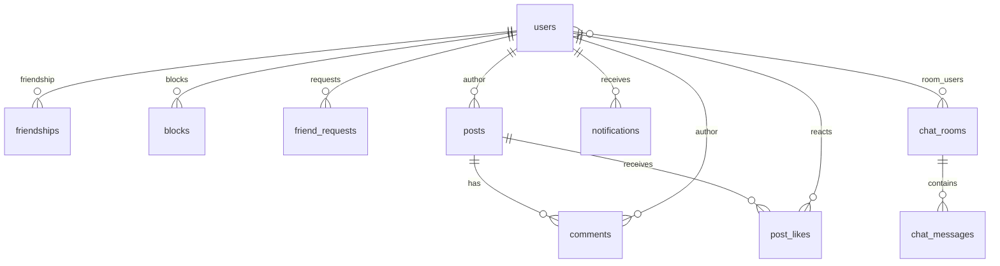

*This project has been created as part of the 42 curriculum by smeixoei, igvisera, davidga2, abarrio-, ancarvaj.*

# ft_transcendence

A full-stack social web platform — the final 42 School project — combining social
networking, real-time communication and real-time multiplayer games in a single
web application, deployed with Docker and instrumented with a complete
observability stack.

---

## Table of Contents

- [Description](#description)
- [Team Information](#team-information)
- [Project Management](#project-management)
- [Technical Stack](#technical-stack)
- [Database Schema](#database-schema)
- [Features List](#features-list)
- [Modules](#modules)
- [Individual Contributions](#individual-contributions)
- [Instructions](#instructions)
- [Resources](#resources)
- [Known Limitations](#known-limitations)
- [License](#license)

---

## Description

**ft_transcendence** is the capstone project of the 42 common core. The goal is to
build, from scratch, a complete and deployable web platform: users can register,
log in (locally or through their 42 account), build a rich profile, interact with
each other through friends, posts and a real-time chat, and play real-time
multiplayer games against each other — all behind a secure reverse proxy and with
full monitoring and logging.

The project was designed to be a modern "social network" clone: a single-page
application (SPA) served by Nginx, a REST API plus WebSocket layer written in Go,
a PostgreSQL database, Redis for ephemeral state, and a DevOps toolchain
(Prometheus, Grafana, ELK Stack) that makes the platform observable in production.

### Key features

| Area | Features |
|------|----------|
| **Authentication** | Local register/login, OAuth 2.0 login with 42 Intra, JWT sessions, TOTP two-factor authentication, account deletion |
| **Profiles** | Custom avatar & banner, personal state/description, birthday, visit counters, profile views depending on relationship |
| **Social graph** | Friend requests (send/accept/reject), block & unblock, delete friendship |
| **Content** | Posts with text, images and PDF upload, comments, likes & dislikes, delete confirmations |
| **Real-time chat** | Persistent WebSocket chat , message history, block-aware message sending, optimistic inserts, unread activity |
| **Notifications** | Real-time push (WS) + HTTP polling for friend requests, likes, comments and accepted requests |
| **Search** | Advanced search with filters, ordering and pagination over the user base |
| **Games** | Real-time multiplayer **Tic Tac Toe**, **Connect Four** and **Game of the Goose** (up to 6 players), local & online modes, spectators, disconnect/reconnect handling |
| **DevOps** | Docker Compose orchestration, Nginx reverse proxy with TLS, Prometheus + Grafana, ELK Stack, CI via GitHub Actions |
| **Testing** | pytest integration suite, Go unit tests, automated CI pipeline |

---

## Team Information

| Member | Login | Assigned roles | Responsibilities |
|--------|-------|----------------|------------------|
| Sara Meixoeiro | `smeixoei` | Product Owner/Technical Lead - Backend & Frontend & DevOps Developer | Frontend designer; Designed and implemented the real-time game engine (backend) and the games UI (frontend); initial frontend setup (router, styles, aliases); health check endpoint; DevOps; OAuth 42; DB-Gorm integration; Healthcheck; 2FA; CORS |
| Ángela Barrio | `abarrio-` | Project Manager/Technical Lead - Frontend & Backend Developer | Backend Designer; Routing & server conf; Advanced search (backend + frontend); profile layout and relationship-based views; block/unblock/delete-friend interactions; 404 page; early project scaffolding, epics documentation and error-handling middleware. |
| Ignacio Viseras | `igvisera` | Frontend Developer | Redis integration and environment configuration; base UI components; profile view; Responsive; UX UI desing |
| David García Varas | `davidga2` | Technical Lead - Frontend & Backend Developer | Posts, comments and reactions (likes/dislikes); image and PDF upload; avatar and banner management; reusable UI components; visual identity and SCSS/BEM design system; footer informational pages. Login & register pages; DB-Gorm integration |
| ancarvaj | `ancarvaj` | Frontend & Backend & DevOps Developer | WebSocket architecture (hub, rooms, clients); persistent chat; notifications system; Nginx WebSocket proxying; Docker Compose infrastructure; GitHub Actions CI; integration of games over WebSockets; AGENTS.md; Blocks relations |

---

## Project Management

### Work organization

- **Feature-driven development**: the team worked in parallel feature branches
  (`feat-*`, `chat`, `notifications`, `ws-games`, `advanced-search`, `posts`, …)
  that were integrated into `main` through **pull requests with code reviews**.
- **Epics as roadmap**: the project was planned around documented epics
  (`docs/epicas/`) that mapped every epic to the subject modules it fulfilled.
- **Meetings**: regular stand-ups and review sessions; decisions (architecture,
  data model, module selection) were discussed as a team before implementation.
- **Task distribution**: tasks were split by feature area and largely by member
  specialization, keeping a single "owner" per feature while sharing the review
  load.

### Tools

| Tool | Purpose |
|------|---------|
| GitHub Issues / Projects | Task tracking and backlog |
| GitHub Pull Requests | Code review and integration |
| GitHub Actions | CI pipeline (integration tests on every push) |
| Git | Version control (feature branches + `main`) |
| Docker Compose | Local and production orchestration |

### Communication channels

- **Discord** — primary daily communication (including screensharing for bugs).
- **In-person / 42 campus stand-ups** — planning, demos and retro.

---

## Technical Stack

### Frontend

| Technology | Version | Purpose |
|-----------|---------|---------|
| React | 19 | UI library |
| TypeScript | 5 | Type-safe frontend code |
| Rsbuild | 1 | Bundler / dev server (Webpack-ecosystem successor) |
| react-router | 7 | Routing (declarative + data router) |
| SCSS (BEM) | — | Styling / design system |
| pnpm | 10 | Package manager |
| react-datepicker, react-icons, date-fns-tz | — | Date picking, icons, timezone handling |

### Backend

| Technology | Version | Purpose |
|-----------|---------|---------|
| Go | 1.25 | Backend language (great concurrency for WebSockets) |
| Gin | latest | HTTP framework (routing, middleware, binding) |
| GORM | latest | ORM + AutoMigrate (models are the schema) |
| gorilla/websocket | latest | WebSocket server implementation |
| go-redis | v9 | Redis client (sessions, 2FA tokens) |
| JWT | — | Stateless session tokens (`utils/token.go`) |
| pquerna/otp | latest | TOTP for two-factor authentication |

### Database

**PostgreSQL 16** was chosen because:

- The domain is inherently **relational** (users ↔ friendships ↔ posts ↔ comments
  ↔ chat rooms/messages), where referential integrity and transactions matter.
- First-class support in **GORM**, which lets the team evolve the schema simply by
  editing the Go structs (`AutoMigrate`), removing manual SQL migration overhead.
- Mature tooling (pgAdmin, backups) and it is the standard relational engine the
  team is most comfortable operating in Docker.

**Redis** complements it for ephemeral state: JWT session invalidation, temporary
2FA tokens and fast in-memory lookups.

### Other significant technologies

| Technology | Purpose |
|-----------|---------|
| Nginx | Reverse proxy, TLS termination, static serving, WebSocket upgrade proxying |
| Docker Compose | Reproducible multi-service environment (dev + prod) |
| Prometheus + Grafana | Metrics collection and dashboards (`/metrics` endpoint, node-exporter, cAdvisor) |
| Elastic Stack (Elasticsearch, Kibana, Logstash, Filebeat, Metricbeat) | Centralized logging |
| HashiCorp Vault (scaffolded) | Secrets management (provisioned structure) |
| Portainer | Container management UI |
| Docusaurus | Project documentation site |
| pytest | Backend integration tests |
| GitHub Actions | CI pipeline |

### Justification of major choices

- **Go + Gin**: the project is heavily WebSocket-based (chat + games); Go's
  goroutines and channels map directly to the hub/room/client model and make
  concurrency manageable and testable.
- **React + TypeScript**: mature ecosystem, strong typing across the SPA, and
  React context providers map cleanly onto the WebSocket "providers" pattern
  (WebSocket → Notification → Chat → Games).
- **GORM with AutoMigrate**: rapid iteration during development; the models are
  the single source of truth for the schema.
- **Redis**: cheap and reliable way to store short-lived session/2FA state without
  polluting the relational schema.
- **Docker Compose**: one command brings up the whole stack, which is exactly what
  the evaluation flow requires.

---

## Database Schema

There are **no hand-written SQL migrations**. GORM runs `AutoMigrate()` on every
backend startup, creating/altering tables from the Go models in
`backend/internal/models/`.



### Tables and key fields

| Table | Key fields | Notes |
|-------|-----------|-------|
| `users` | `id`, `login` (unique), `email`, `password`, `role`, `oauth`, `oauth_id`, `active_2fa`, `secret_2fa`, `name`, `surname`, `birthday`, `avatar_path`, `banner_path`, `status`, `state` | `avatar_path`/`banner_path` are `nil` → default skull avatar/banner. `login` is unique while the account is active. |
| `friendships` | `id`, `user1_id`, `user2_id`, `created_at` | Normalized order: `user1_id < user2_id` **always** (unique index). |
| `blocks` | `id`, `blocker_id`, `blocked_id` | Unique on `(blocker_id, blocked_id)`. Blocking deletes the friendship and pending requests. |
| `friend_requests` | `id`, `sender_id`, `receiver_id`, `status` | `status` ∈ `pending` \| `accepted` \| `rejected`. |
| `chat_rooms` | `id`, `name`, `private` | M2M with `users` through `room_users`. |
| `room_users` | `chat_room_id`, `user_id`, `last_read_at` | Join table (composite PK) tracking last read. |
| `chat_messages` | `id`, `room_id`, `user_id`, `username`, `content`, `timestamp` | Persistent chat history. |
| `posts` | `id`, `user_id`, `content`, `image_path`, `file_name` | Content and/or media; soft delete (`deleted_at`). |
| `comments` | `id`, `post_id`, `user_id`, `content` | Cascading delete with the parent post. |
| `post_likes` | `id`, `post_id`, `user_id`, `reaction` | `reaction` ∈ `1` (like) \| `-1` (dislike); unique per `(post, user)`. |
| `notifications` | `id`, `user_id`, `type`, `payload`, `is_read` | `payload` is JSON with `sender_id`, `username`, etc. |
| `general_chats` | `id`, `message`, `user_id`, `username`, `timestamp` | Legacy model, not used by the current chat. |


---

## Modules

The following modules were selected from the subject. **Major = 2 points**,
**Minor = 1 point**. Total selected: **21 points**.

| Module | Category | Type | Points | Justification | Implementation | Member(s) |
|--------|----------|------|--------|---------------|----------------|-----------|
| Use a framework for the backend and frontend | WEB | Major | 2 | Required foundation; guarantees coherent architecture on both ends | React 19 + TypeScript frontend, Go + Gin backend | Team (all) |
| Real-time features using WebSockets | WEB | Major | 2 | Enables real-time communication and synchronized updates between connected clients | WebSocket infrastructure with connection/disconnection handling, message broadcasting, real-time game events, chat messages and live user updates | ancarvaj, smeixoei |
| Allow users to interact with other users | WEB | Major | 2 | Social-network nature of the app | Friends system, friend requests, blocks, shared rooms | ancarvaj, abarrio- |
| Use an ORM for the database | WEB | Minor | 1 | Simplifies database access and keeps data models consistent with the application | GORM ORM with structured models, relationships, queries and `AutoMigrate` for database schema management | davidga2, smeixoei |
| Complete notification system | WEB | Minor | 1 | Keeps users informed about relevant creation, update and deletion actions throughout the application | Real-time notifications through WebSockets for events such as friend requests, friendship changes, posts, messages and other user-related actions | ancarvaj |
| Custom-made design system | USER EXPERIENCE | Minor | 1 | Provides a consistent visual identity and reusable UI patterns across the application | Custom SCSS design system with a defined color palette, typography, variables and mixins, plus 10+ reusable components such as Header, Footer, Button, Modal, Card, Avatar, Input, Dropdown, Notification and UserMenu | Team (all) |
| Advanced search functionality | USER EXPERIENCE | Minor | 1 | Users must find each other efficiently | Backend search service with filters/order + frontend panel with pagination | abarrio- |
| File upload and management system | WEB | Minor | 1 | Users need to personalize their profiles and attach media | `storage/` package (image validation/saving), uploads served via Nginx | davidga2 |
| OAuth 2.0 | USER MANAGEMENT | Minor | 1 | Seamless 42-campus login, avoids onboarding friction | Authorization-code flow against `api.intra.42.fr` | smeixoei |
| Two-factor authentication | USER MANAGEMENT | Minor | 1 | Strong security for the auth module | TOTP with `pquerna/otp`, QR provisioning, temp-token login step | smeixoei |
| Standard user management & authentication | WEB | Major | 2 | Provides the complete user management and authentication system required by the project | JWT authentication with register/login and protected routes; users can update their profile information, upload a custom avatar or use the default avatar, add and manage friends, view their friends' online status, and access a dedicated profile page with their information | abario-, ancarvaj |

| Real-time multiplayer online games | GAME | Major | 2 | Showcases WebSockets and concurrency; the "wow" feature | Game engines (`ticTacToe.go`, `connectFour.go`, `goose.go`), game manager, WS `game` message type, canvas frontends | smeixoei |
| ELK Stack | DEVOPS | Major | 2 | Centralized logging and debugging across services | Elasticsearch + Kibana + Logstash + Filebeat + Metricbeat in Docker Compose | ancarvaj, smeixoei |
| Prometheus & Grafana | DEVOPS | Major | 2 | Observability of the whole stack | `/metrics` endpoint (promhttp), Prometheus scraping, Grafana dashboards, node-exporter, cAdvisor | ancarvaj, smeixoei |


| Live chat (advanced chat features) | GAME | Minor | 1 | Real-time interaction between users with persistence | WebSocket rooms, message history, block-aware sending, optimistic UI | ancarvaj |


| Two-factor authentication | USER MANAGEMENT | Minor | 1 | Strong security for the auth module | TOTP with `pquerna/otp`, QR provisioning, temp-token login step | igvisera |

| Custom-made design system | USER EXPERIENCE | Minor | 1 | Cohesive branding, reuse across pages | SCSS BEM architecture, variables/mixins, reusable components (Header, Footer, Modal, cards…) | davidga2, abarrio- |


---

## Instructions

### Prerequisites

| Software | Version / note |
|----------|----------------|
| Docker Engine + Docker Compose v2 | Required for the recommended (containerized) run |
| `make` | Required for the convenience targets |
| Git | To clone the repository |
| Go | 1.25+ (only needed for local backend development) |
| Node.js 20+ and pnpm 10 | Only needed for local frontend development |

### Environment configuration

1. Clone the repository:

   ```bash
   git clone <repo-url> && cd ft_transcendence
   ```

2. Create your environment file from the template:

   ```bash
   cp .env.example .env
   ```

3. Edit `.env` at least for these values:

   | Variable | Notes |
   |----------|-------|
   | `JWT_SECRET` | Change the default secret |
   | `DB_PASSWORD`, `REDIS_PASSWORD` | Use strong passwords |
   | `OAUTH42_CLIENT_ID` / `OAUTH42_CLIENT_SECRET` | From your 42 Intra app (create one at https://profile.intra.42.fr/oauth/applications/new) |
   | `OAUTH42_REDIRECT_URI` | Must match the registered redirect URI, e.g. `https://localhost:6969/api/v1/auth/42/callback` |

### Running the full stack (production-like)

```bash
make daemon          # build images and start in background
```

Then open **https://localhost:6969** in your browser (accept the self-signed
certificate warning). HTTP on port `1312` redirects to HTTPS.

### Running the development environment

```bash
make dev             # full dev stack (includes monitoring) — heavy on RAM
make dev-min         # lightweight: backend, frontend, nginx, postgres, redis
make dev-min-demon   # same but detached
make dev-stop        # stop the dev environment
```

- The dev backend mounts the source with hot-reload.
- The lightweight compose exposes the backend directly on `:8080` and Redis on
  `:7777` for easier debugging.

### Useful commands

| Command | Description |
|---------|-------------|
| `make daemon` | Build and start the full stack in the background |
| `make logs s=backend` | Tail logs of a specific service (`s=backend`, `s=frontend`, …) |
| `make shell s=backend` | Open a shell inside a container |
| `make stop` | Stop and remove containers |
| `make remove` | Stop, remove containers, volumes and local images |
| `make re` | Full reset (remove + start again) |
| `make build-pgadmin` | Start pgAdmin (depends on Postgres) |

### Access points

| Service | URL |
|---------|-----|
| Web application | `https://localhost:6969` |
| Backend API | `https://localhost:6969/api/v1` |
| Health check | `http://localhost:8080/health` (or via Nginx) |
| Prometheus metrics | `http://localhost:8080/metrics` |
| Grafana | `https://grafana.localhost:6969` (add `grafana.localhost` → `127.0.0.1` in `/etc/hosts`) |
| Kibana | `https://kibana.localhost:6969` |
| pgAdmin | `https://pgadmin.localhost:6969` |
| RedisInsight | `https://redis.localhost:6969` |
| Portainer | `https://portainer.localhost:6969` |

### Running the tests

**Backend unit tests** (from `backend/`):

```bash
go test ./...
go test -race ./...   # with the race detector
```

**Integration tests** (from `tests/`, requires the backend running):

```bash
make -C tests         # creates a venv, installs deps, runs pytest
```

A **GitHub Actions** workflow runs the integration suite automatically on every
push to `main`.

### Local development without Docker

```bash
# Backend
cd backend
go build -o api ./cmd/api && ./api

# Frontend
cd frontend
pnpm install
pnpm dev            # dev server on :3000
pnpm lint           # eslint
pnpm check          # biome check --write
pnpm build          # production build
```

---

## Resources

### Classic references

- **42 ft_transcendence subject** — the official project specification.
- **React** — https://react.dev (docs), TypeScript — https://www.typescriptlang.org
- **Go** — https://go.dev/doc, **Gin** — https://gin-gonic.com/docs,
  **GORM** — https://gorm.io/docs
- **gorilla/websocket** — https://github.com/gorilla/websocket — used for the
  chat and games.
- **WebSockets (MDN)** — https://developer.mozilla.org/en-US/docs/Web/API/WebSockets_API
- **JWT** — https://jwt.io/introduction
- **OAuth 2.0 (RFC 6749)** — https://datatracker.ietf.org/doc/html/rfc6749 ;
  42 API — https://api.intra.42.fr/apidoc
- **TOTP (RFC 6238)** — https://datatracker.ietf.org/doc/html/rfc6238
- **Redis** — https://redis.io/docs
- **Nginx** — https://nginx.org/en/docs (reverse proxy, WebSocket proxying)
- **Docker Compose** — https://docs.docker.com/compose
- **Prometheus** — https://prometheus.io/docs ; **Grafana** — https://grafana.com/docs
- **Elastic Stack** — https://www.elastic.co/docs
- **pytest** — https://docs.pytest.org

### Use of AI

AI assistants (GitHub Copilot and ChatGPT) were used throughout the project as
**programming assistants**, always reviewed by a team member before merging:

- **Code generation and scaffolding**: initial Go project structure, Gin route
  skeletons, React components and hooks, Dockerfiles and docker-compose services.
- **Debugging and concurrency**: identifying and fixing deadlocks/races in the
  WebSocket hub/room code, resolving `send on closed channel` panics, and
  debugging WebSocket reconnection and game-state synchronization.
- **Styling**: generating SCSS for the design system and page layouts.
- **Testing**: writing pytest fixtures and integration test cases, and Go unit
  tests for the storage layer.
- **Documentation**: drafting this README and the AGENTS.md architectural guide.

AI output was treated as a suggestion layer: every generated snippet was
understood, adapted and verified by the owning team member, and no AI-generated
code was merged without a manual review.

---

## Known Limitations

- **Organization system** (subject module) was planned but not implemented; the
  team prioritized chat, notifications and games instead.
- **Vault** and **ModSecurity (WAF)** are present as *scaffolding* (configs,
  Dockerfiles) but are not fully wired into the running services.
- The **frontend container** runs its dev server (`pnpm dev`) even in the
  production compose; a static build would be the next optimization.
- TLS uses **self-signed certificates** included in the repo (development only);
  a production deployment should use Let's Encrypt or a proper CA.
- The `general_chats` table is a **legacy model** left over from early iterations
  and is not used by the current chat implementation.
- Git history includes commits from an early contributor no longer part of the
  team (initial scaffolding); final contributions are the ones documented here.

---

## License

This is a **42 School educational project**; no license is applied. All rights
belong to its authors.

---

*Generated and maintained by the ft_transcendence team — 42 Madrid.*